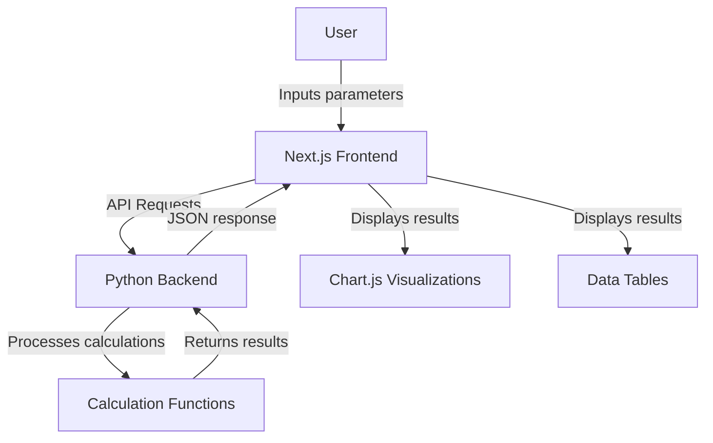
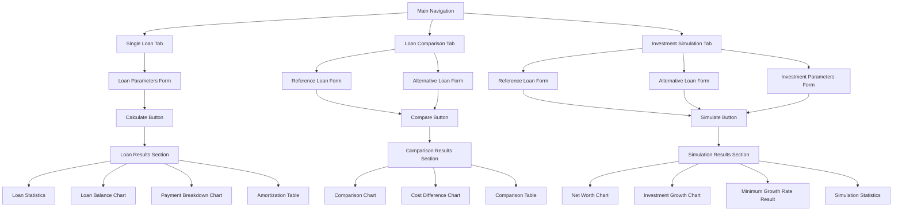

# Loan Browser Technical Implementation

This document outlines the detailed technical implementation for the Loan Browser application, expanding on the high-level plan.

## Data Flow Architecture



## Backend API Structure

### Python FastAPI Implementation

```python
# Sample FastAPI structure
from fastapi import FastAPI, HTTPException
from fastapi.middleware.cors import CORSMiddleware
from pydantic import BaseModel
import numpy as np
import pandas as pd
from calculation_functions import (
    simuleer_klassieke_lening,
    simuleer_modulaire_lening,
    simuleer_met_investering,
    bereken_statistieken,
    bereken_min_groei_voor_betaling,
    aggregeer_jaarlijks
)

app = FastAPI()

# Add CORS middleware
app.add_middleware(
    CORSMiddleware,
    allow_origins=["http://localhost:3000"],
    allow_credentials=True,
    allow_methods=["*"],
    allow_headers=["*"],
)

# Data models
class LoanParameters(BaseModel):
    loan_type: str  # "annuity" or "bullet"
    principal: float
    interest_rate: float
    term_years: int
    own_contribution: float
    purchase_price: float = 825000
    delay_months: int = 0
    start_year: int = 2025
    insurance_coverage_pct: float = 1.0

class ModularLoanSchedule(BaseModel):
    schedule: list[tuple[int, float]]  # [(month, amount), ...]

class InvestmentParameters(BaseModel):
    start_capital: float = 120000
    annual_growth_rate: float = 0.08

class ComparisonRequest(BaseModel):
    reference_loan: LoanParameters
    alternative_loan: LoanParameters
    reference_own_contribution: float
    alternative_own_contribution: float
    investment_params: InvestmentParameters = None
    modular_schedule: ModularLoanSchedule = None

# Endpoints
@app.post("/api/calculate-loan")
def calculate_loan(params: LoanParameters, modular_schedule: ModularLoanSchedule = None):
    try:
        if params.loan_type == "annuity":
            result_df = simuleer_klassieke_lening(
                eigen_inbreng=params.own_contribution,
                jaarlijkse_rentevoet=params.interest_rate,
                looptijd_jaren=params.term_years,
                aankoopprijs=params.purchase_price,
                uitstel_maanden=params.delay_months,
                start_jaar_kalender=params.start_year,
                schuldsaldo_dekking_pct=params.insurance_coverage_pct,
                loan_type=params.loan_type
            )
        else:  # bullet or modular
            if not modular_schedule:
                raise HTTPException(status_code=400, detail="Modular loan schedule required for bullet/modular loans")
            
            result_df = simuleer_modulaire_lening(
                eigen_inbreng=params.own_contribution,
                jaarlijkse_rentevoet=params.interest_rate,
                looptijd_jaren=params.term_years,
                aflossings_schema=modular_schedule.schedule,
                aankoopprijs=params.purchase_price,
                start_jaar_kalender=params.start_year,
                schuldsaldo_dekking_pct=params.insurance_coverage_pct,
                loan_type=params.loan_type
            )
        
        # Convert DataFrame to JSON serializable format
        monthly_data = result_df.to_dict(orient="records")
        annual_data = aggregeer_jaarlijks(result_df).to_dict(orient="records")
        statistics = bereken_statistieken(result_df, hoofdsom=(params.purchase_price - params.own_contribution))
        
        return {
            "monthly_data": monthly_data,
            "annual_data": annual_data,
            "statistics": statistics
        }
    except Exception as e:
        raise HTTPException(status_code=500, detail=str(e))

@app.post("/api/compare-loans")
def compare_loans(request: ComparisonRequest):
    try:
        # Calculate reference loan
        ref_loan = calculate_loan(request.reference_loan)
        
        # Calculate alternative loan
        alt_loan = calculate_loan(request.alternative_loan, request.modular_schedule)
        
        # If investment params provided, calculate investment simulation
        if request.investment_params:
            investment_simulation, start_inv = simuleer_met_investering(
                df_referentie=pd.DataFrame(ref_loan["monthly_data"]),
                df_alternatief=pd.DataFrame(alt_loan["monthly_data"]),
                eigen_inbreng_referentie=request.reference_own_contribution,
                eigen_inbreng_alternatief=request.alternative_own_contribution,
                start_kapitaal_totaal=request.investment_params.start_capital,
                maandelijkse_groei_investering=(1 + request.investment_params.annual_growth_rate)**(1/12) - 1
            )
            
            # Calculate required growth rate
            required_growth = bereken_min_groei_voor_betaling(
                df_combined=investment_simulation,
                payment_maand=request.alternative_loan.term_years * 12,  # Last month
                payment_bedrag=request.alternative_loan.principal,  # Full loan amount
                start_investering=start_inv
            )
            
            return {
                "reference_loan": ref_loan,
                "alternative_loan": alt_loan,
                "investment_simulation": investment_simulation.to_dict(orient="records"),
                "minimum_required_growth_rate": required_growth,
                "comparison_stats": {
                    "total_cost_difference": ref_loan["statistics"]["Totale Kosten Lening (Rente + SSV)"] - 
                                            alt_loan["statistics"]["Totale Kosten Lening (Rente + SSV)"],
                    "net_worth_end_of_term": investment_simulation["Netto Vermogen (Invest - Schuld)"].iloc[-1]
                }
            }
        else:
            return {
                "reference_loan": ref_loan,
                "alternative_loan": alt_loan
            }
    except Exception as e:
        raise HTTPException(status_code=500, detail=str(e))
```

## Frontend TypeScript Interfaces

```typescript
// src/types/loan.ts

export type LoanType = 'annuity' | 'bullet' | 'modular';

export interface LoanParameters {
  loanType: LoanType;
  principal: number;
  interestRate: number;
  termYears: number;
  ownContribution: number;
  purchasePrice?: number;
  delayMonths?: number;
  startYear?: number;
  insuranceCoveragePct?: number;
}

export interface ModularLoanScheduleItem {
  month: number;
  amount: number;
}

export interface ModularLoanSchedule {
  schedule: ModularLoanScheduleItem[];
}

export interface MonthlyLoanData {
  Maand: number;
  Jaar: number;
  "Betaling Lening (Excl. SSV)": number;
  Rente: number;
  "Kapitaal Aflossing": number;
  "Schuldsaldo Premie (Maand)": number;
  "Totale Maandelijkse Uitgave": number;
  "Resterend Kapitaal": number;
  "Cumulatief Kapitaal Betaald": number;
  "Cumulatief Rente Betaald": number;
  "Cumulatief SSV Betaald": number;
}

export interface AnnualLoanData {
  Jaar: number;
  Jaarlijkse_Rente: number;
  Jaarlijkse_Kapitaalaflossing: number;
  Jaarlijkse_SSV: number;
  Jaarlijkse_Totale_Uitgave: number;
  Resterend_Kapitaal_Einde_Jaar: number;
  Cumul_Rente_Einde_Jaar: number;
  Cumul_SSV_Einde_Jaar: number;
  Cumul_Kapitaal_Einde_Jaar: number;
}

export interface LoanStatistics {
  "Totaal Kapitaal Betaald": number;
  "Totale Rente Betaald": number;
  "Totale SSV Premie Betaald": number;
  "Totale Kosten Lening (Rente + SSV)": number;
  "Hoogste Maandelijkse Uitgave Lening": number;
}

export interface LoanCalculationResult {
  monthlyData: MonthlyLoanData[];
  annualData: AnnualLoanData[];
  statistics: LoanStatistics;
}

export interface InvestmentParameters {
  startCapital?: number;
  annualGrowthRate?: number;
}

export interface InvestmentSimulationData extends MonthlyLoanData {
  "Saldo Investering": number;
  "Maandelijkse Bijdrage/Onttrekking": number;
  "Cumulatieve Bijdrage Investering": number;
  "Netto Vermogen (Invest - Schuld)": number;
}

export interface ComparisonResult {
  referenceLoan: LoanCalculationResult;
  alternativeLoan: LoanCalculationResult;
  investmentSimulation?: InvestmentSimulationData[];
  minimumRequiredGrowthRate?: number;
  comparisonStats?: {
    totalCostDifference: number;
    netWorthEndOfTerm: number;
  };
}
```

## Component Structure

### Form Components

```typescript
// Components/Forms/LoanParametersForm.tsx
import React from 'react';
import { useForm } from 'react-hook-form';
import { zodResolver } from '@hookform/resolvers/zod';
import { z } from 'zod';
import { LoanParameters, LoanType } from '@/types/loan';

const loanParametersSchema = z.object({
  loanType: z.enum(['annuity', 'bullet', 'modular']),
  principal: z.number().positive(),
  interestRate: z.number().min(0).max(100),
  termYears: z.number().int().positive(),
  ownContribution: z.number().min(0),
  purchasePrice: z.number().positive().optional(),
  delayMonths: z.number().int().min(0).optional(),
  startYear: z.number().int().positive().optional(),
  insuranceCoveragePct: z.number().min(0).max(1).optional(),
});

interface LoanParametersFormProps {
  defaultValues?: Partial<LoanParameters>;
  onSubmit: (data: LoanParameters) => void;
  isLoading?: boolean;
}

export function LoanParametersForm({ defaultValues, onSubmit, isLoading }: LoanParametersFormProps) {
  const { register, handleSubmit, watch, formState: { errors } } = useForm<LoanParameters>({
    resolver: zodResolver(loanParametersSchema),
    defaultValues: {
      loanType: 'annuity',
      principal: 500000,
      interestRate: 3.5,
      termYears: 30,
      ownContribution: 100000,
      purchasePrice: 825000,
      delayMonths: 0,
      startYear: 2025,
      insuranceCoveragePct: 1.0,
      ...defaultValues
    }
  });

  const currentLoanType = watch('loanType');

  return (
    <form onSubmit={handleSubmit(onSubmit)} className="space-y-6">
      <div className="grid grid-cols-1 md:grid-cols-2 gap-4">
        {/* Loan Type Selection */}
        <div className="col-span-2">
          <label className="block text-sm font-medium text-gray-700">Loan Type</label>
          <div className="mt-1 flex space-x-4">
            <label className="inline-flex items-center">
              <input
                type="radio"
                {...register('loanType')}
                value="annuity"
                className="h-4 w-4 text-blue-600"
              />
              <span className="ml-2">Annuity</span>
            </label>
            <label className="inline-flex items-center">
              <input
                type="radio"
                {...register('loanType')}
                value="bullet"
                className="h-4 w-4 text-blue-600"
              />
              <span className="ml-2">Bullet</span>
            </label>
            <label className="inline-flex items-center">
              <input
                type="radio"
                {...register('loanType')}
                value="modular"
                className="h-4 w-4 text-blue-600"
              />
              <span className="ml-2">Modular</span>
            </label>
          </div>
          {errors.loanType && <p className="mt-1 text-sm text-red-600">{errors.loanType.message}</p>}
        </div>

        {/* Purchase Price */}
        <div>
          <label className="block text-sm font-medium text-gray-700">Purchase Price (€)</label>
          <input
            type="number"
            {...register('purchasePrice', { valueAsNumber: true })}
            className="mt-1 block w-full px-3 py-2 border border-gray-300 rounded-md shadow-sm focus:outline-none focus:ring-blue-500 focus:border-blue-500"
          />
          {errors.purchasePrice && <p className="mt-1 text-sm text-red-600">{errors.purchasePrice.message}</p>}
        </div>

        {/* Own Contribution */}
        <div>
          <label className="block text-sm font-medium text-gray-700">Down Payment / Own Contribution (€)</label>
          <input
            type="number"
            {...register('ownContribution', { valueAsNumber: true })}
            className="mt-1 block w-full px-3 py-2 border border-gray-300 rounded-md shadow-sm focus:outline-none focus:ring-blue-500 focus:border-blue-500"
          />
          {errors.ownContribution && <p className="mt-1 text-sm text-red-600">{errors.ownContribution.message}</p>}
        </div>

        {/* Principal Amount */}
        <div>
          <label className="block text-sm font-medium text-gray-700">Loan Principal (€)</label>
          <input
            type="number"
            {...register('principal', { valueAsNumber: true })}
            className="mt-1 block w-full px-3 py-2 border border-gray-300 rounded-md shadow-sm focus:outline-none focus:ring-blue-500 focus:border-blue-500"
          />
          {errors.principal && <p className="mt-1 text-sm text-red-600">{errors.principal.message}</p>}
        </div>

        {/* Interest Rate */}
        <div>
          <label className="block text-sm font-medium text-gray-700">Interest Rate (%)</label>
          <input
            type="number"
            step="0.01"
            {...register('interestRate', { valueAsNumber: true })}
            className="mt-1 block w-full px-3 py-2 border border-gray-300 rounded-md shadow-sm focus:outline-none focus:ring-blue-500 focus:border-blue-500"
          />
          {errors.interestRate && <p className="mt-1 text-sm text-red-600">{errors.interestRate.message}</p>}
        </div>

        {/* Term */}
        <div>
          <label className="block text-sm font-medium text-gray-700">Loan Term (Years)</label>
          <input
            type="number"
            {...register('termYears', { valueAsNumber: true })}
            className="mt-1 block w-full px-3 py-2 border border-gray-300 rounded-md shadow-sm focus:outline-none focus:ring-blue-500 focus:border-blue-500"
          />
          {errors.termYears && <p className="mt-1 text-sm text-red-600">{errors.termYears.message}</p>}
        </div>

        {/* Start Year */}
        <div>
          <label className="block text-sm font-medium text-gray-700">Start Year</label>
          <input
            type="number"
            {...register('startYear', { valueAsNumber: true })}
            className="mt-1 block w-full px-3 py-2 border border-gray-300 rounded-md shadow-sm focus:outline-none focus:ring-blue-500 focus:border-blue-500"
          />
          {errors.startYear && <p className="mt-1 text-sm text-red-600">{errors.startYear.message}</p>}
        </div>

        {/* Insurance Coverage */}
        <div>
          <label className="block text-sm font-medium text-gray-700">Insurance Coverage (%)</label>
          <input
            type="number"
            step="0.01"
            min="0"
            max="100"
            {...register('insuranceCoveragePct', { 
              valueAsNumber: true,
              setValueAs: v => parseFloat(v) / 100 // Convert percentage to decimal
            })}
            className="mt-1 block w-full px-3 py-2 border border-gray-300 rounded-md shadow-sm focus:outline-none focus:ring-blue-500 focus:border-blue-500"
          />
          {errors.insuranceCoveragePct && <p className="mt-1 text-sm text-red-600">{errors.insuranceCoveragePct.message}</p>}
        </div>

        {/* Delay Months */}
        <div>
          <label className="block text-sm font-medium text-gray-700">Payment Delay (Months)</label>
          <input
            type="number"
            {...register('delayMonths', { valueAsNumber: true })}
            className="mt-1 block w-full px-3 py-2 border border-gray-300 rounded-md shadow-sm focus:outline-none focus:ring-blue-500 focus:border-blue-500"
          />
          {errors.delayMonths && <p className="mt-1 text-sm text-red-600">{errors.delayMonths.message}</p>}
        </div>
      </div>

      {/* Additional fields for bullet/modular loans would go here */}
      
      <div className="flex justify-end">
        <button
          type="submit"
          disabled={isLoading}
          className="px-4 py-2 bg-blue-600 text-white rounded-md shadow-sm hover:bg-blue-700 focus:outline-none focus:ring-2 focus:ring-offset-2 focus:ring-blue-500 disabled:opacity-50"
        >
          {isLoading ? 'Calculating...' : 'Calculate Loan'}
        </button>
      </div>
    </form>
  );
}
```

### Chart Components

```typescript
// Components/Charts/LoanBalanceChart.tsx
import React from 'react';
import {
  Chart as ChartJS,
  CategoryScale,
  LinearScale,
  PointElement,
  LineElement,
  Title,
  Tooltip,
  Legend,
} from 'chart.js';
import { Line } from 'react-chartjs-2';
import { MonthlyLoanData } from '@/types/loan';

ChartJS.register(
  CategoryScale,
  LinearScale,
  PointElement,
  LineElement,
  Title,
  Tooltip,
  Legend
);

interface LoanBalanceChartProps {
  data: MonthlyLoanData[];
  title?: string;
}

export function LoanBalanceChart({ data, title = 'Loan Balance Over Time' }: LoanBalanceChartProps) {
  const chartData = {
    labels: data.map(d => `${d.Jaar}-${d.Maand.toString().padStart(2, '0')}`),
    datasets: [
      {
        label: 'Remaining Principal',
        data: data.map(d => d['Resterend Kapitaal']),
        borderColor: 'rgb(53, 162, 235)',
        backgroundColor: 'rgba(53, 162, 235, 0.5)',
      },
      {
        label: 'Cumulative Interest',
        data: data.map(d => d['Cumulatief Rente Betaald']),
        borderColor: 'rgb(255, 99, 132)',
        backgroundColor: 'rgba(255, 99, 132, 0.5)',
      },
      {
        label: 'Cumulative Insurance',
        data: data.map(d => d['Cumulatief SSV Betaald']),
        borderColor: 'rgb(75, 192, 192)',
        backgroundColor: 'rgba(75, 192, 192, 0.5)',
      },
    ],
  };

  const options = {
    responsive: true,
    plugins: {
      legend: {
        position: 'top' as const,
      },
      title: {
        display: true,
        text: title,
      },
      tooltip: {
        callbacks: {
          label: function(context: any) {
            let label = context.dataset.label || '';
            if (label) {
              label += ': ';
            }
            if (context.parsed.y !== null) {
              label += new Intl.NumberFormat('nl-NL', { style: 'currency', currency: 'EUR' }).format(context.parsed.y);
            }
            return label;
          }
        }
      }
    },
    scales: {
      y: {
        ticks: {
          callback: function(value: any) {
            return new Intl.NumberFormat('nl-NL', { style: 'currency', currency: 'EUR' }).format(value);
          }
        }
      }
    }
  };

  return (
    <div className="bg-white p-4 rounded-lg shadow">
      <Line options={options} data={chartData} />
    </div>
  );
}
```

### Table Components

```typescript
// Components/Tables/LoanStatisticsTable.tsx
import React from 'react';
import { LoanStatistics } from '@/types/loan';

interface LoanStatisticsTableProps {
  statistics: LoanStatistics;
  title?: string;
}

export function LoanStatisticsTable({ statistics, title = 'Loan Statistics' }: LoanStatisticsTableProps) {
  const formatCurrency = (value: number) => {
    return new Intl.NumberFormat('nl-NL', { style: 'currency', currency: 'EUR' }).format(value);
  };

  return (
    <div className="bg-white p-4 rounded-lg shadow">
      <h3 className="text-lg font-medium mb-4">{title}</h3>
      <div className="overflow-x-auto">
        <table className="min-w-full divide-y divide-gray-200">
          <thead className="bg-gray-50">
            <tr>
              <th scope="col" className="px-6 py-3 text-left text-xs font-medium text-gray-500 uppercase tracking-wider">
                Metric
              </th>
              <th scope="col" className="px-6 py-3 text-right text-xs font-medium text-gray-500 uppercase tracking-wider">
                Value
              </th>
            </tr>
          </thead>
          <tbody className="bg-white divide-y divide-gray-200">
            <tr>
              <td className="px-6 py-4 whitespace-nowrap text-sm font-medium text-gray-900">
                Total Principal Paid
              </td>
              <td className="px-6 py-4 whitespace-nowrap text-sm text-gray-500 text-right">
                {formatCurrency(statistics['Totaal Kapitaal Betaald'])}
              </td>
            </tr>
            <tr>
              <td className="px-6 py-4 whitespace-nowrap text-sm font-medium text-gray-900">
                Total Interest Paid
              </td>
              <td className="px-6 py-4 whitespace-nowrap text-sm text-gray-500 text-right">
                {formatCurrency(statistics['Totale Rente Betaald'])}
              </td>
            </tr>
            <tr>
              <td className="px-6 py-4 whitespace-nowrap text-sm font-medium text-gray-900">
                Total Insurance Premiums
              </td>
              <td className="px-6 py-4 whitespace-nowrap text-sm text-gray-500 text-right">
                {formatCurrency(statistics['Totale SSV Premie Betaald'])}
              </td>
            </tr>
            <tr>
              <td className="px-6 py-4 whitespace-nowrap text-sm font-medium text-gray-900">
                Total Loan Costs (Interest + Insurance)
              </td>
              <td className="px-6 py-4 whitespace-nowrap text-sm text-gray-500 text-right">
                {formatCurrency(statistics['Totale Kosten Lening (Rente + SSV)'])}
              </td>
            </tr>
            <tr>
              <td className="px-6 py-4 whitespace-nowrap text-sm font-medium text-gray-900">
                Median Monthly Payment
              </td>
              <td className="px-6 py-4 whitespace-nowrap text-sm text-gray-500 text-right">
                {formatCurrency(statistics['Hoogste Maandelijkse Uitgave Lening'])}
              </td>
            </tr>
          </tbody>
        </table>
      </div>
    </div>
  );
}
```

## API Service

```typescript
// services/loanApi.ts
import { 
  LoanParameters, 
  ModularLoanSchedule, 
  LoanCalculationResult,
  InvestmentParameters,
  ComparisonResult
} from '@/types/loan';

const API_BASE_URL = 'http://localhost:8000/api';

export async function calculateLoan(
  params: LoanParameters, 
  modularSchedule?: ModularLoanSchedule
): Promise<LoanCalculationResult> {
  const requestBody: any = { ...params };
  
  if (modularSchedule) {
    requestBody.modular_schedule = modularSchedule;
  }
  
  const response = await fetch(`${API_BASE_URL}/calculate-loan`, {
    method: 'POST',
    headers: {
      'Content-Type': 'application/json',
    },
    body: JSON.stringify(requestBody),
  });
  
  if (!response.ok) {
    const error = await response.json();
    throw new Error(error.detail || 'Failed to calculate loan');
  }
  
  const data = await response.json();
  
  return {
    monthlyData: data.monthly_data,
    annualData: data.annual_data,
    statistics: data.statistics,
  };
}

export async function compareLoans(
  referenceLoan: LoanParameters,
  alternativeLoan: LoanParameters,
  referenceOwnContribution: number,
  alternativeOwnContribution: number,
  investmentParams?: InvestmentParameters,
  modularSchedule?: ModularLoanSchedule
): Promise<ComparisonResult> {
  const requestBody = {
    reference_loan: referenceLoan,
    alternative_loan: alternativeLoan,
    reference_own_contribution: referenceOwnContribution,
    alternative_own_contribution: alternativeOwnContribution,
    investment_params: investmentParams,
    modular_schedule: modularSchedule,
  };
  
  const response = await fetch(`${API_BASE_URL}/compare-loans`, {
    method: 'POST',
    headers: {
      'Content-Type': 'application/json',
    },
    body: JSON.stringify(requestBody),
  });
  
  if (!response.ok) {
    const error = await response.json();
    throw new Error(error.detail || 'Failed to compare loans');
  }
  
  return await response.json();
}
```

## UI Wireframe/Layout



## Next Steps

1. Set up the project structure with appropriate directories
2. Implement the Python FastAPI backend first
3. Create the TypeScript interfaces and API service
4. Develop the UI components incrementally
5. Implement page routing and overall layout
6. Add state management for saving multiple loan scenarios
7. Enhance with export functionality and mobile responsiveness
