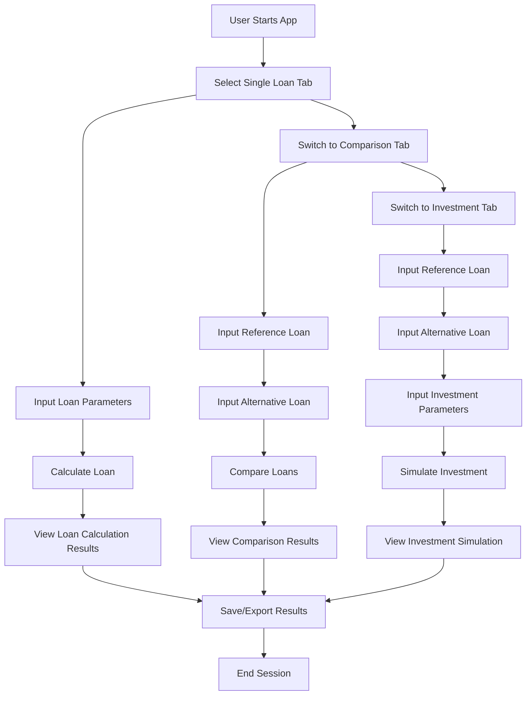

# Loan Browser UI Mockups

This document provides wireframes and UI mockups for the Loan Browser application, showing the layout and interaction flow for the key screens.

## Main Layout

The application will have a responsive layout with the following key areas:

```
+-------------------------------------------------------+
|                     HEADER / LOGO                     |
+-------------------------------------------------------+
|                                                       |
|     [Single Loan] [Loan Comparison] [Investment]      |
|                                                       |
+-------------------------------------------------------+
|                                                       |
|                   CONTENT AREA                        |
|                                                       |
|  +-------------------+  +------------------------+    |
|  |                   |  |                        |    |
|  |   INPUT FORMS     |  |    RESULTS AREA        |    |
|  |                   |  |                        |    |
|  |                   |  |                        |    |
|  |                   |  |                        |    |
|  +-------------------+  +------------------------+    |
|                                                       |
+-------------------------------------------------------+
|                      FOOTER                           |
+-------------------------------------------------------+
```

## Single Loan View

The Single Loan view allows users to calculate and visualize a single loan.

```
+-------------------------------------------------------+
|                     HEADER / LOGO                     |
+-------------------------------------------------------+
|                                                       |
|     [SINGLE LOAN] [Loan Comparison] [Investment]      |
|                                                       |
+-------------------------------------------------------+
|                                                       |
|  +-------------------+  +------------------------+    |
|  | LOAN PARAMETERS   |  |    RESULTS AREA        |    |
|  | [Loan Type      ▼]|  |  +------------------+  |    |
|  | [Purchase Price  ]|  |  | LOAN STATISTICS   |  |    |
|  | [Own Contribution]|  |  | Total Interest: € |  |    |
|  | [Loan Principal  ]|  |  | Total Cost: €     |  |    |
|  | [Interest Rate   ]|  |  | Monthly Payment: €|  |    |
|  | [Loan Term       ]|  |  +------------------+  |    |
|  | [Start Year      ]|  |                        |    |
|  | [Insurance %     ]|  |  +------------------+  |    |
|  |                   |  |  | LOAN BALANCE CHART |  |    |
|  | [CALCULATE]       |  |  |                   |  |    |
|  |                   |  |  |                   |  |    |
|  |                   |  |  |                   |  |    |
|  |                   |  |  +------------------+  |    |
|  |                   |  |                        |    |
|  |                   |  |  +------------------+  |    |
|  |                   |  |  | PAYMENT BREAKDOWN |  |    |
|  |                   |  |  |                   |  |    |
|  |                   |  |  |                   |  |    |
|  |                   |  |  +------------------+  |    |
|  |                   |  |                        |    |
|  |                   |  |  +------------------+  |    |
|  |                   |  |  | AMORTIZATION TABLE |  |    |
|  |                   |  |  |                   |  |    |
|  |                   |  |  |                   |  |    |
|  |                   |  |  +------------------+  |    |
|  +-------------------+  +------------------------+    |
|                                                       |
+-------------------------------------------------------+
```

## Loan Comparison View

The Loan Comparison view allows users to compare two different loan scenarios.

```
+-------------------------------------------------------+
|                     HEADER / LOGO                     |
+-------------------------------------------------------+
|                                                       |
|     [Single Loan] [LOAN COMPARISON] [Investment]      |
|                                                       |
+-------------------------------------------------------+
|                                                       |
|  +-------------------+  +------------------------+    |
|  | REFERENCE LOAN    |  |    COMPARISON RESULTS  |    |
|  | [Loan Type      ▼]|  |  +------------------+  |    |
|  | [Purchase Price  ]|  |  | COMPARISON SUMMARY|  |    |
|  | [Own Contribution]|  |  | Difference: €     |  |    |
|  | [Other params...  ]|  |  | Savings:   €     |  |    |
|  |                   |  |  +------------------+  |    |
|  +-------------------+  |                        |    |
|                         |  +------------------+  |    |
|  +-------------------+  |  | COMPARISON CHART  |  |    |
|  | ALTERNATIVE LOAN  |  |  |                   |  |    |
|  | [Loan Type      ▼]|  |  |                   |  |    |
|  | [Purchase Price  ]|  |  |                   |  |    |
|  | [Own Contribution]|  |  +------------------+  |    |
|  | [Other params...  ]|  |                        |    |
|  |                   |  |  +------------------+  |    |
|  +-------------------+  |  | COST BREAKDOWN    |  |    |
|                         |  |                   |  |    |
|  +-------------------+  |  |                   |  |    |
|  | [COMPARE LOANS]   |  |  +------------------+  |    |
|  +-------------------+  |                        |    |
|                         |  +------------------+  |    |
|                         |  | COMPARISON TABLE  |  |    |
|                         |  |                   |  |    |
|                         |  |                   |  |    |
|                         |  +------------------+  |    |
|                         +------------------------+    |
|                                                       |
+-------------------------------------------------------+
```

## Investment Simulation View

The Investment Simulation view allows users to compare loans with investment of the difference in payments.

```
+-------------------------------------------------------+
|                     HEADER / LOGO                     |
+-------------------------------------------------------+
|                                                       |
|     [Single Loan] [Loan Comparison] [INVESTMENT]      |
|                                                       |
+-------------------------------------------------------+
|                                                       |
|  +-------------------+  +------------------------+    |
|  | REFERENCE LOAN    |  |    SIMULATION RESULTS  |    |
|  | [Loan Type      ▼]|  |  +------------------+  |    |
|  | [Purchase Price  ]|  |  | SIMULATION STATS  |  |    |
|  | [Own Contribution]|  |  | Net Worth: €      |  |    |
|  | [Other params...  ]|  |  | Min. Growth: %   |  |    |
|  |                   |  |  +------------------+  |    |
|  +-------------------+  |                        |    |
|                         |  +------------------+  |    |
|  +-------------------+  |  | NET WORTH CHART   |  |    |
|  | ALTERNATIVE LOAN  |  |  |                   |  |    |
|  | [Loan Type      ▼]|  |  |                   |  |    |
|  | [Purchase Price  ]|  |  |                   |  |    |
|  | [Own Contribution]|  |  +------------------+  |    |
|  | [Other params...  ]|  |                        |    |
|  |                   |  |  +------------------+  |    |
|  +-------------------+  |  | INVESTMENT GROWTH |  |    |
|                         |  |                   |  |    |
|  +-------------------+  |  |                   |  |    |
|  | INVESTMENT PARAMS |  |  +------------------+  |    |
|  | [Start Capital   ]|  |                        |    |
|  | [Growth Rate %   ]|  |  +------------------+  |    |
|  +-------------------+  |  | MONTHLY CASHFLOW  |  |    |
|                         |  |                   |  |    |
|  +-------------------+  |  |                   |  |    |
|  | [SIMULATE]        |  |  +------------------+  |    |
|  +-------------------+  +------------------------+    |
|                                                       |
+-------------------------------------------------------+
```

## Mobile View (Responsive Layout)

On mobile devices, the layout will stack vertically:

```
+-------------------------------+
|         HEADER / LOGO         |
+-------------------------------+
|                               |
| [Single] [Compare] [Invest]   |
|                               |
+-------------------------------+
|                               |
|      INPUT FORMS AREA         |
|                               |
|  +----------------------+     |
|  | LOAN PARAMETERS      |     |
|  | [Loan Type         ▼]|     |
|  | [Purchase Price     ]|     |
|  | [Own Contribution   ]|     |
|  | [Loan Principal     ]|     |
|  | [Interest Rate      ]|     |
|  | [Loan Term          ]|     |
|  | [Start Year         ]|     |
|  | [Insurance %        ]|     |
|  |                      |     |
|  | [CALCULATE]          |     |
|  +----------------------+     |
|                               |
+-------------------------------+
|                               |
|       RESULTS AREA            |
|                               |
|  +----------------------+     |
|  | LOAN STATISTICS      |     |
|  | Total Interest: €    |     |
|  | Total Cost: €        |     |
|  | Monthly Payment: €   |     |
|  +----------------------+     |
|                               |
|  +----------------------+     |
|  | LOAN BALANCE CHART   |     |
|  |                      |     |
|  |                      |     |
|  |                      |     |
|  +----------------------+     |
|                               |
|  +----------------------+     |
|  | PAYMENT BREAKDOWN    |     |
|  |                      |     |
|  |                      |     |
|  +----------------------+     |
|                               |
|  +----------------------+     |
|  | AMORTIZATION TABLE   |     |
|  |                      |     |
|  |                      |     |
|  +----------------------+     |
|                               |
+-------------------------------+
|            FOOTER             |
+-------------------------------+
```

## Chart Examples

Below are mockups of the main charts that will be implemented:

### Loan Balance Chart

```
LOAN BALANCE OVER TIME
│
│
│       ┌─────────────────────────────
│      /│
│     / │
│    /  │
│   /   │                 ┌───────────
│  /    │                /
│ /     │               /
│/      │              /
├───────┴─────────────┴─────────────────► Time
│
   ── Principal  ── Interest  ── Insurance
```

### Payment Breakdown Chart

```
PAYMENT BREAKDOWN
│
│█    █    █    █    █    █    █    █
│█    █    █    █    █    █    █    █
│█    █    █    █    █    █    █    █
│█    █    █    █    █    █    █    █
│█▒   █▒   █▒   █▒   █▒   █▒   █▒   █▒
│█▒   █▒   █▒   █▒   █▒   █▒   █▒   █▒
│█▒░  █▒░  █▒░  █▒░  █▒░  █▒░  █▒░  █▒░
├───────────────────────────────────────► Time
│
   █ Principal  ▒ Interest  ░ Insurance
```

### Comparison Chart

```
LOAN COMPARISON
│
│
│       ┌─────────────────────────────
│      /│                  ┌───────────
│     / │                 /
│    /  │                /
│   /   │               /
│  /    │              /
│ /     │             /
│/      │            /
├───────┴───────────┴───────────────────► Time
│
   ── Loan A  ── Loan B  ── Difference
```

### Investment Growth Chart

```
INVESTMENT GROWTH WITH NET WORTH
│                                    ┌──
│                                   /
│                                  /
│                                 /
│                              ┌─┘
│                           ┌─┘
│                        ┌─┘
│       ┌───────────────┘             
│      /│                           
│     / │                          
│    /  │                         
│   /   │                        
│  /    │                       
│ /     │                      
│/      │                     
├───────┴───────────────────────────────► Time
│
   ── Loan Balance  ── Investment  ── Net Worth
```

## Component Relationships

```mermaid
graph TD
    LoanForm[Loan Parameters Form] --> LoanCalculation[Loan Calculation]
    LoanCalculation --> Stats[Statistics Display]
    LoanCalculation --> BalanceChart[Loan Balance Chart]
    LoanCalculation --> PaymentChart[Payment Breakdown Chart]
    LoanCalculation --> AmortizationTable[Amortization Table]
    
    RefLoanForm[Reference Loan Form] --> ComparisonCalc[Comparison Calculation]
    AltLoanForm[Alternative Loan Form] --> ComparisonCalc
    ComparisonCalc --> ComparisonStats[Comparison Statistics]
    ComparisonCalc --> ComparisonChart[Comparison Chart]
    ComparisonCalc --> DifferenceChart[Cost Difference Chart]
    ComparisonCalc --> ComparisonTable[Comparison Table]
    
    RefLoanForm --> InvestmentCalc[Investment Simulation]
    AltLoanForm --> InvestmentCalc
    InvestParams[Investment Parameters] --> InvestmentCalc
    InvestmentCalc --> InvestmentStats[Investment Statistics]
    InvestmentCalc --> NetWorthChart[Net Worth Chart]
    InvestmentCalc --> GrowthChart[Investment Growth Chart]
    InvestmentCalc --> CashFlowTable[Monthly Cash Flow Table]
```



## User Flow



## Interactive Elements

### Form Controls

- **Text Inputs**: For numerical values like loan amounts, interest rates
- **Dropdown Selects**: For loan types and other categorical selections
- **Sliders**: For adjustable parameters like loan term, interest rate
- **Radio Buttons**: For binary choices
- **Date Pickers**: For selecting start dates
- **Buttons**: For actions like calculate, compare, reset

### Chart Interactivity

- **Tooltips**: Show detailed values on hover
- **Zoom Controls**: Zoom in/out on chart data
- **Toggle Series**: Show/hide specific data series
- **Time Range Selector**: Filter data by time periods
- **Export Options**: Save chart as image or data

### Table Interactivity

- **Sorting**: Sort by columns
- **Filtering**: Filter data based on criteria
- **Pagination**: Navigate through large datasets
- **Expandable Rows**: Show additional details
- **Export Options**: Download as CSV or Excel
